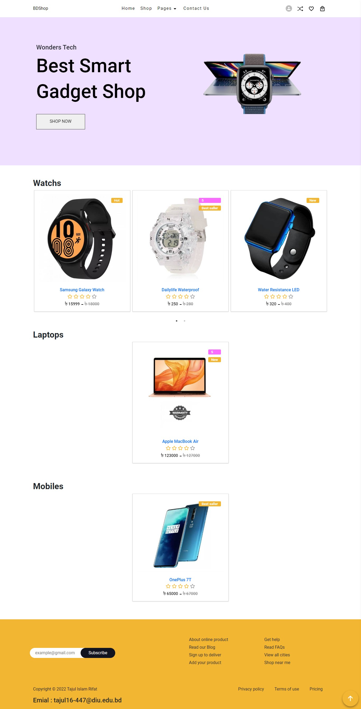

# **BDShop-Ecommarce, Website**

## Top Features

**BDshop** is a full-stack single-page ecommarce web app.

- Login / Registration system , private routes and dashboard for admins .
- OTP login by email
- Email verify
- Forgot password By OTP
- Send email template into email.
- User can download invoice as pdf
- Users can order products, monitor their orderlist and create product review
- Coupon code system
- Admin can add product, category and update and delete products.
- Admin can change the status of orderlist and can add new admins.

### Front-end Technology :

- **React,React-Router-Dom**
- **React-Redux , Redux-thunk**
- **React-Bootstrap**
- **CSS3**
- **React-helmet , React-image-file-resizer , validator**

### Back-end Technology :

- **Node**
- **Express**
- **MongoDB useing Mongoose**
- **Cloudinary for uploding pictures**
- **Others , bcrypt , body-parse , cookie-parser, jsonwebtoken, validator , express-fileupload**

### `Website Link :` 

